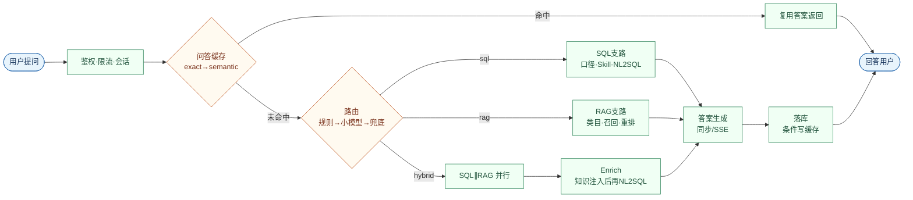

# 傲基智能问答 · 一页讲稿（链路 + 演示问句）

> 分享会投屏用：先讲清「从提问到回答」一条主线，再按场景点名行动线。  
> 每个演示题建议 **新开会话**（测缓存除外）。

---

## 1. 一张图讲完主链路（横向 · 适合 16:9 PPT 截图）

> 预览后放大到全宽再截图；节点文案已按横版压短。



**分支说明（可放 PPT 备注或图下小字）：**

| 分支 | 含义 |
|---|---|
| 缓存命中 | 短路，不走路由/检索/生成 |
| sql | 只查结构化（口径 + 专项 Skill + NL2SQL） |
| rag | 只查内部文档 |
| hybrid | 先并行 SQL∥RAG，再 Enrich 后 NL2SQL |

**三句收束：**

1. **先缓存，后 Agent**——命中则整段短路。  
2. **先规则，后小模型**——定 sql / rag / hybrid。  
3. **hybrid = 并行检索 + 知识注入 SQL**，不是简单串行。

---

## 2. 演示剧本（问句 → 轨迹要点 → 讲解词）

| # | 演示问句 | 行动线应看到 | 30 秒讲解 |
|---|---|---|---|
| 1 | `近 7 天 GMV 是多少？按站点看一下` | 规则→**sql**→指标口径→**NL2SQL**→生成 | 典型 Text-to-SQL：口径对齐再查数 |
| 2 | `帮我找一下哪些产品需要补货了，应该补多少合适` | **库存预警 Skill** 成功；NL2SQL 常跳过 | 专项 Skill 优先于通用 SQL |
| 3 | `床类广告 ACOS 是否超标？有没有空耗，要不要降出价` | **广告诊断 Skill** | 规则化诊断 + 建议 |
| 4 | `近 30 天退货原因分布？破损是否偏高` | **退货归因 Skill** | 原因码聚合 + 业务归因 |
| 5 | `FBA 入库和标签有什么规范？` | 规则→**rag**→引用「FBA 入库与标签规范」 | 制度走向量库，不是猜通用亚马逊常识 |
| 6 | `退货处理规范是什么？美国站多久可退？` | RAG 命中「跨境电商退货处理规范」；**30 天**等要点 | 强调：空库会胡说「没文档」 |
| 7 | `近 7 天退货率偏高的 SKU，对照退货政策该怎么处理` | **hybrid**→**SQL∥RAG 并行**→Enrich→生成 | 演示并行与知识注入 |
| 8 | `帮我看看最近经营情况怎么样` | **小模型意图分类**（规则弱） | 模糊问法才上路由小模型 |
| 9 | ① 先问补货原句 ② **新会话**再问同句加 `？` | **缓存查找命中（exact）**→复用答案 | 查找≠命中；真命中后面无路由 |
| 10 | 同会话：先 GMV，再问 `换成近 30 天` | 缓存仅 exact / **跳过 semantic** | 追问防串答，必须承接上文 |

---

## 3. 分支一张表（提问时备用）

| 若出现… | 含义 |
|---|---|
| 缓存查找未命中，后面很长 | 正常走 Agent |
| 缓存查找命中，后面几乎没有 | 短路成功 |
| 路由兜底 → hybrid | 小模型失败，降级双通道 |
| RAG 说「未检索到内部文档」 | 向量库空或 API 未重启（灌库后要 restart） |
| NL2SQL 跳过 | 专项 Skill 已覆盖 |
| 组员查不到海运/成本 | ACL：敏感表禁查，不是「系统不能执行 SQL」 |
| 答案像通用百科 | RAG 空 + 模型幻觉，不是权限问题 |

---

## 4. 现场口令（运维一句）

```bash
# 业务 mock 刷到今天
.venv/bin/python scripts/seed_mysql.py --force

# 知识库（容器内）
docker compose -f docker-compose.prod.yml exec au-agent-api \
  sh -c 'rm -rf /app/data/chroma/*; python scripts/ingest_rag.py --force'
docker compose -f docker-compose.prod.yml restart au-agent-api
```

---

## 5. 建议演示顺序（8～10 分钟）

`GMV(NL2SQL)` → `补货(库存Skill)` → `ACOS(广告)` → `FBA规范(RAG)` → `对照政策(Hybrid并行)` → `exact缓存` → （可选）模糊问法触发小模型路由。

Admin 账号打开 **执行轨迹** 页对照行动线讲解即可。
